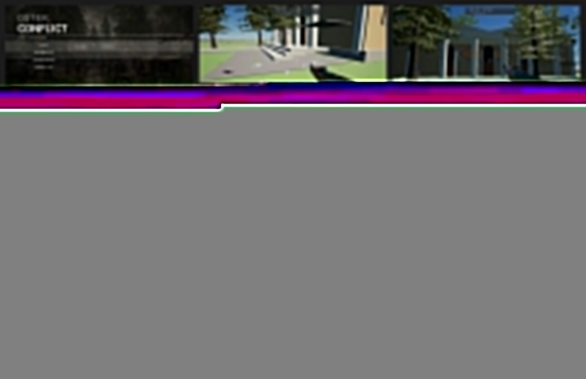

# OSTER CONFLICT — PASS 45 RUNTIME RECOVERY TZ

Date: 2026-08-24
Status: **ACTIVE / SOURCE IMPLEMENTATION IN PROGRESS / RUNTIME UNTESTED**
Branch: `fix/runtime-recovery-pass-45-20260824`
Target: UE 5.8.x Windows
User launcher: `START_HERE.cmd`

## 0. Why this TZ exists

Pass 44 was implemented from the active requirements in `OSTER_CONFLICT_WORK_LEDGER.md` and root `AGENTS.md`; there was no separate complete Pass 44 TZ that combined runtime acceptance, visual fidelity, performance baseline and content truth in one contract. The first factual local run after merge disproved several Pass 44 assumptions.

Therefore this file is the canonical corrective TZ. It does not erase Pass 44 history. It records Pass 44 as **RUNTIME REJECTED** and converts the newest screenshots + source audit into explicit Pass 45 work and acceptance gates.

Latest runtime evidence pack:

Manifest: `RUNTIME_EVIDENCE/2026-08-24_PASS44_REJECTED/MANIFEST.md`

---

# 1. Authoritative runtime verdict

The latest user run reached menu and gameplay, but the result is rejected.

Observed runtime facts:

- Main menu already shows about **8 FPS**.
- Gameplay is roughly **8–12 FPS**, with visible stutter/lag.
- Severe slowdown persists even in visually empty fields.
- Several rack weapons are **white / missing intended authored materials**.
- Held AK has a readable material while nearby pickup weapons do not, proving that successful mesh loading is not equivalent to material readiness.
- Tactical map is visually malformed and does not match the real compact central-Oster topology.
- Primitive/generic trees remain visible and do not match the required Oster vegetation character.
- Visible world quality is substantially worse than the intended target: flat green ground, primitive blocks, crude landmark shells and low-fidelity vegetation.
- Museum and Culture House still do not present as two clearly separated, correctly placed and visually identifiable landmarks.
- Silpo/legacy location presentation still contains stale visual identity and layered runtime construction.

**Pass 44 status: RUNTIME REJECTED.**

Green source CI from Pass 44 remains evidence that the source contract compiled/verified. It is not runtime acceptance.

---

# 2. Root-cause audit

## 2.1 Performance diagnosis: bot count was real but not the root cause

Pass 44 correctly removed implicit 16-player bot autofill from normal local gameplay. The latest screenshots prove this was insufficient because the frontend itself already runs around 8 FPS.

Therefore the root performance investigation must start before gameplay-only systems.

High-priority suspects requiring factual A/B measurement:

1. **Renderer/RHI compatibility launch path.** The rejected run used `-d3d11 -sm5 -nohdr -norhithread`. `-norhithread` was retained as a crash-recovery compatibility measure and must not silently become the permanent performance baseline. Pass 45 now provides normal DX11/SM5 RHI threading plus an explicit `-norhithread` compatibility route for factual A/B measurement.
2. **Editor runtime overhead.** Current playtest is `UnrealEditor.exe -game`, not a packaged Shipping/Development game executable. Editor-mode overhead must be distinguished from project GameThread/Draw/RHI/GPU cost.
3. **Accumulated delayed runtime mutation subsystems.** The project contains multiple post-BeginPlay scanners/rebuilders/recovery guards. Repeated world scans, instance removal, `MarkRenderStateDirty`, delayed landmark reconstruction and compatibility ownership checks can create frame spikes and long startup degradation.
4. **Overlarge cull distances relative to the new compact battlefield.** Several world families previously remained visible across most or all of the 960×940 m sector. Pass 45 source now rebudgets those family distances for the compact map.
5. **Primitive world authoring still creates large quantities of generic ISM geometry.** Compact bounds reduced extent, not necessarily frame cost per visible sector.

Pass 45 must collect frame-domain evidence, not only FPS. Current source adds separate frontend/gameplay sampling and world-density evidence; factual UE runtime is still required.

## 2.2 Primitive world is still the visible production world

`OCWorldSectorOster` still retains engine BasicShapes as historical/source authoring for major semantic families. Pass 45 does not pretend those assets became production art merely because they compile.

Current corrective source behavior:

- primitive Cylinder/Sphere tree families are explicitly hidden/retired from normal runtime;
- real `SM_Pine_Tree_01` and `SM_Pine_Tree_03` are verified content candidates already used by the Museum tree owner;
- no separately verified oak asset has been found, therefore oak remains a named content gap rather than a fabricated claim;
- other visible BasicShape world families remain subject to the production-asset inventory and runtime screenshot gate.

## 2.3 Tree vegetation is wrong by construction

Required current vegetation identity:

- tall pine / conifer forest as the dominant museum/park woodland character where reference supports it;
- appropriate oak assets where broadleaf trees are required;
- no fantasy-like swollen trunks / spherical crowns;
- no primitive Cylinder/Sphere tree family visible in normal gameplay.

Source implementation now retires all eight primitive trunk/crown visual families from normal runtime. This is **CODED_UNTESTED** until a factual screenshot proves they are absent and real foliage reads correctly.

## 2.4 Tactical map was bounded but not rebuilt from correct topology

Pass 44 correctly reduced projection bounds, but the rejected `M` view still inherited old procedural world geometry.

Pass 45 source correction now:

- keeps the compact 960×940 m projection;
- traces a dedicated north-up street skeleton from `REFERENCE_PHOTOS/map_extent/oster_central_playable_area_20260824.jpg` (640×630 reference raster);
- converts those reference pixels into compact sector coordinates;
- no longer reads `Roads`, `Sidewalks`, `Buildings`, `ResidentialRoofs`, `LandmarkBlocks` or `LandmarkRoofs` procedural ISMs as tactical-map truth;
- places Museum / Culture House / Silpo / central park / Stadium markers from the common `FOCGeoReference` authority;
- emits `PASS45_TACTICAL_REFERENCE_TOPOLOGY_READY`.

This is a reference-traced topology approximation, not a cadastral/GIS survey. A new runtime `M` screenshot remains mandatory.

## 2.5 Weapon mesh load is not material readiness

Pass 45 now audits the complete fresh-load chain for all 11 required weapon visuals:

`weapon -> exact mesh -> material slots -> material assets -> used texture dependencies -> fresh dependency load result`

The NullRHI preflight now writes:

- mesh report;
- authored material report;
- machine-readable `required_weapon_material_texture_dependencies.json`;
- separate mesh/material/texture dependency status;
- `PASS45_WEAPON_DEPENDENCY_AUDIT_COMPLETE`.

A null/default/BasicShape material, a default/white placeholder texture, a missing texture dependency, or a material with no discoverable texture dependency remains a visible gap rather than being painted over. M16/M4 are not added because no verified payload exists.

## 2.6 Museum / Culture House / Silpo ownership is over-layered

Pass 45 source audit identified a concrete contract defect: historical Pass 21 treated both R13.7 and R13.8 as simultaneous Museum shell owners even though R13.8 suppresses R13.7 solid prototype components and builds a second segmented architecture actor.

The current single-shell contract is now:

- **Museum shell owner:** `R138_MuseumHighFidelityArchitecture`;
- **Museum reference/detail/interactivity parent:** `R137_MuseumPhotoModel` (not a second shell);
- **Silpo shell owner:** `R140_SilpoPhotoModel`;
- **Culture House shell owner:** `R146_CultureHouseAuthoritative`;
- Stadium authority unchanged.

The ownership guard repairs duplicate actors per canonical tag and validates exactly one current shell per site after the startup window. It emits `PASS45_SINGLE_LANDMARK_SHELL_OWNERS_READY` or a fail marker. Runtime visual separation is still unverified.

---

# 3. Pass 45 implementation work

## Phase A — recover a measurable performance baseline

### A1. RHI-thread A/B launch path

Source implementation: **CODED_UNTESTED**.

- DirectX 11 + SM5 + no HDR retained.
- Normal game uses normal RHI threading.
- `START_HERE.cmd` exposes an explicit compatibility route that adds `-norhithread`.
- D3D12/SM6 remains disabled until DX11 baseline is stable.
- launcher/log prints the selected renderer mode.

Acceptance remains runtime-only:

- main menu remains open without historical RenderTargetPool crash;
- compare frontend FPS/frame times normal vs compatibility route;
- if normal RHI threading crashes, preserve crash evidence and revert only that route.

### A2. Runtime performance instrumentation

Source implementation: **CODED_UNTESTED**.

Required markers are implemented:

- `PASS45_FRONTEND_PERF_BASELINE`
- `PASS45_GAMEPLAY_PERF_BASELINE`
- `PASS45_RHI_MODE`

Sampling is one-shot/bounded and does not mutate graphics quality to disguise low FPS.

### A3. Stop repeated full-world repair loops

Source implementation: **CODED_UNTESTED**.

- old landmark-separation 0.20 s × 40 full-world scan loop retired;
- one delayed reconciliation remains;
- actor-spawn guard handles late forbidden legacy owners;
- final shell ownership validation is one-shot;
- startup coordinator cancels historical delayed landmark timers and runs current stages in one coordinated startup window;
- one shell owner per Museum/Silpo/Culture site is now explicit.

### A4. Compact-sector render budget

Source implementation: **CODED_UNTESTED**.

Cull distances have been recalculated for the 960×940 m battlefield. Runtime pop-in/performance still requires factual observation.

---

## Phase B — remove visible primitive production proxies

### B1. Retire primitive tree generator from normal gameplay

Source implementation: **CODED_UNTESTED**.

- all eight primitive Cylinder/Sphere tree families are hidden in normal runtime;
- verified real pines remain available;
- oak remains an explicit content gap until a real suitable asset is verified;
- old birch/poplar proxy families are not restored merely to satisfy historical source checks.

### B2. World proxy truth

**IN_PROGRESS.** Tree proxies are classified/retired. Other BasicShape world families still require production-asset inventory and factual visual replacement decisions. Invisible gameplay collision helpers may remain where necessary.

---

## Phase C — tactical map topology correction

### C1. Real compact-Oster topology

Source implementation: **CODED_UNTESTED**.

- tactical map uses a dedicated reference-traced street layer from the retained central-Oster image;
- procedural world road/building ISMs no longer define `M` topology;
- POIs use one geo-reference authority;
- projection remains north-up and bounded by compact playable area.

### C2. Tactical map acceptance screenshot

**PENDING RUNTIME.** Reject if giant synthetic X/diagonal roads remain, POIs overlap, obsolete geometry expands the map, or player marker is hidden/missing.

---

## Phase D — landmark ownership consolidation

### D1. Museum

Source implementation: **CODED_UNTESTED**.

- R13.8 is the single current shell owner;
- R13.7 is a reference/detail/interactivity parent only;
- duplicate current R13.8 shell actors are rejected/repaired;
- visual identity near spawn remains a runtime screenshot gate.

### D2. Culture House

Source implementation: **CODED_UNTESTED**.

- R14.6 is the single shell owner;
- distinct `FOCGeoReference::CultureHouse()` anchor retained;
- no Museum-coordinate inheritance is accepted;
- duplicate R14.6 owners are rejected/repaired.

### D3. Silpo

Source implementation: **CODED_UNTESTED**.

- R14.0 is the single shell owner;
- R14.1–R14.3 remain detail-only stages and do not satisfy the shell-owner tag;
- duplicate R14.0 shells are rejected/repaired;
- stale visual identity still requires factual runtime inspection.

---

## Phase E — weapon material dependency closure

Audit implementation: **CODED_UNTESTED**. Dependency closure: **IN_PROGRESS** until the next fresh UE preflight produces the actual report.

For each of 11 required weapon visuals the fresh-load preflight now records:

- exact visual asset path;
- material slot count;
- every material path;
- used texture paths;
- missing/placeholder texture dependencies;
- material result;
- texture dependency result.

Any gap remains explicit `CONTENT GAP` / `IN_PROGRESS`. A new rack screenshot is still required before visual acceptance.

---

# 4. Stale behavior that must not return

Pass 45 explicitly forbids reintroducing:

1. implicit normal-game bot autofill;
2. 2.4 km procedural playable map;
3. map bounds derived from arbitrary component extents;
4. grey runtime BasicShape “repair” for weapon materials;
5. primitive Cylinder/Sphere trees as accepted normal-game vegetation;
6. repeated late landmark rebuilders competing for the same location;
7. source verifier expectations that force obsolete proxy behavior back into runtime;
8. declaring a mesh/material/location READY from source checks when latest runtime screenshot contradicts it;
9. hiding performance collapse by automatically lowering resolution scale below the intended 100% clarity baseline;
10. adding new decorative content before frontend/gameplay performance baseline is recovered.

---

# 5. Pass 45 acceptance gates

Pass 45 cannot be called verified until factual UE runtime satisfies all applicable gates.

## Gate 1 — frontend

- menu opens reliably;
- no RenderTargetPool startup crash;
- measured frontend performance is no longer ~8 FPS;
- target for acceptance: **>=30 FPS minimum**, with frame-domain evidence recorded.

## Gate 2 — gameplay performance

- enter normal local game with bots off;
- remain only as long as thermals are safe;
- no progressive collapse to 8–12 FPS;
- **>=30 FPS minimum** is required for current acceptance;
- no automated graphics downgrade below intended native 100% clarity target.

## Gate 3 — vegetation

- no primitive fantasy-like tree forest;
- tall pine/conifer character visible where expected;
- no production claim for missing oak/pine assets.

## Gate 4 — tactical map

- `M` visually matches compact central-Oster topology;
- synthetic X/giant straight procedural roads are gone;
- player marker visible;
- landmarks distinct.

## Gate 5 — landmarks

- Museum and Culture House are visibly separate and correctly located;
- Silpo stale/duplicate identity removed;
- one placement owner per landmark.

## Gate 6 — weapons

- all required rack weapons have authored material truth or an explicit named content gap;
- no white/default slot accepted;
- fresh texture dependencies must load;
- screenshot evidence required.

## Gate 7 — evidence and CI

- source CI must pass after stale verifiers are retired/forward-ported;
- CI alone cannot promote the pass to VERIFIED;
- latest user runtime screenshot/log overrides historical source assumptions.

---

# 6. Execution order

1. Lock this TZ + runtime evidence into the branch. **DONE**.
2. Update ledger to mark Pass 44 `RUNTIME REJECTED` and Pass 45 active. **DONE**.
3. Implement RHI-thread A/B route and performance markers. **CODED_UNTESTED**.
4. Retire repeated landmark world-mutation loop / enforce single ownership. **CODED_UNTESTED**.
5. Recalculate render/cull budgets for compact map. **CODED_UNTESTED**.
6. Remove primitive tree families from normal visual runtime and bind verified real foliage where available. **CODED_UNTESTED; OAK CONTENT GAP**.
7. Rebuild tactical-map topology from authoritative central-Oster reference rather than procedural road blockout. **CODED_UNTESTED**.
8. Run per-weapon material/texture dependency audit and close real asset/material gaps. **AUDIT CODED_UNTESTED; CLOSURE IN_PROGRESS**.
9. Update/retire conflicting historical verifiers. **IN_PROGRESS**.
10. Run full source CI. **IN_PROGRESS**.
11. Merge only after fresh current-head source checks are green. **NOT YET**.
12. After local pull, perform frontend performance test first, then gameplay. **PENDING**.

---

# 7. Current implementation status

- [x] Pass 44 latest runtime classified as **RUNTIME REJECTED**.
- [x] User screenshots archived as Pass 45 evidence sheet + manifest.
- [x] Pass 45 corrective TZ created.
- [x] Ledger updated for Pass 45.
- [x] RHI-thread A/B launcher source implemented (**CODED_UNTESTED**).
- [x] Frontend/gameplay performance baseline instrumentation implemented (**CODED_UNTESTED**).
- [x] 40-pass landmark mutation loop consolidated and single-shell ownership source contract added (**CODED_UNTESTED**).
- [x] Compact render budgets recalculated (**CODED_UNTESTED**).
- [x] Primitive Cylinder/Sphere tree visuals retired from normal runtime; real pines verified; oak remains content gap (**CODED_UNTESTED**).
- [x] Tactical map source rebuilt from the authoritative retained reference topology rather than procedural world ISMs (**CODED_UNTESTED**).
- [x] 11-weapon mesh → material → texture dependency audit implemented (**fresh UE report pending**).
- [ ] Actual authored material/texture gaps from the next fresh preflight closed.
- [ ] Other visible BasicShape world families inventoried/replaced where real content exists.
- [ ] Conflicting historical verifiers fully forward-ported/retired.
- [ ] Full fresh-head source CI green.
- [ ] Local UE 5.8 runtime accepted.
